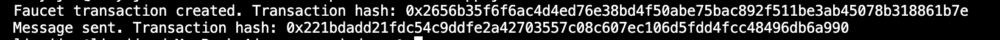
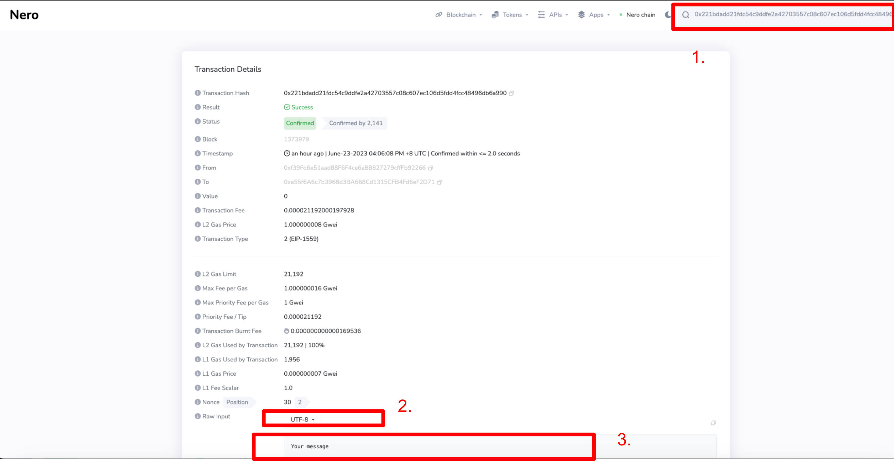

# Creating-Faucet-Transactions-and-Sending-Messages-on-NeroChain-Using-the-API
1. Please clone and operate on it, the following commands are for your reference.

    `git clone https://github.com/yijunlindev/nero-api-demo.git`

2. Open `app.js` file.
3. Replace **0xRecipientAddress** and **message content** in the code with the actual address and the desired message you want to send.
4. Run `node app.js `. 
5. Now, you can use these transaction hash values to query and view the details of these transactions.

6. Visit the [Testnet Explorer](https://testnetscan.nerochain.io/) to view the details of the created faucet transaction and the sent message transaction using the provided transaction hashes.
